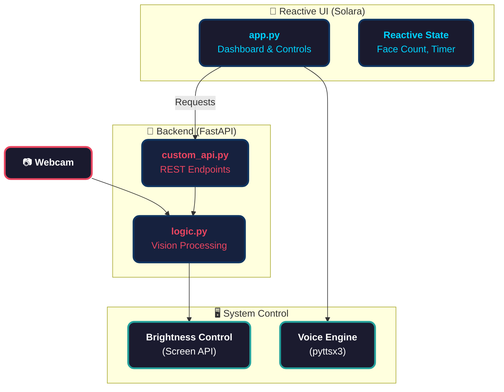
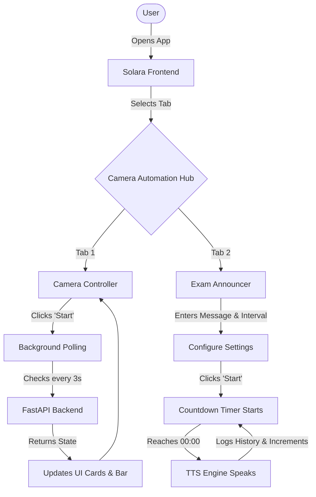
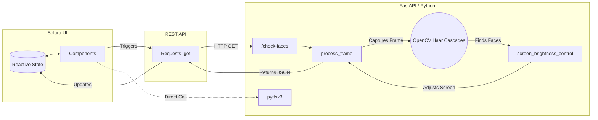
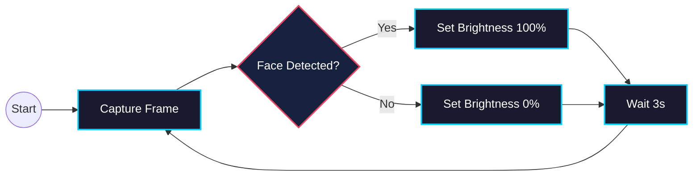
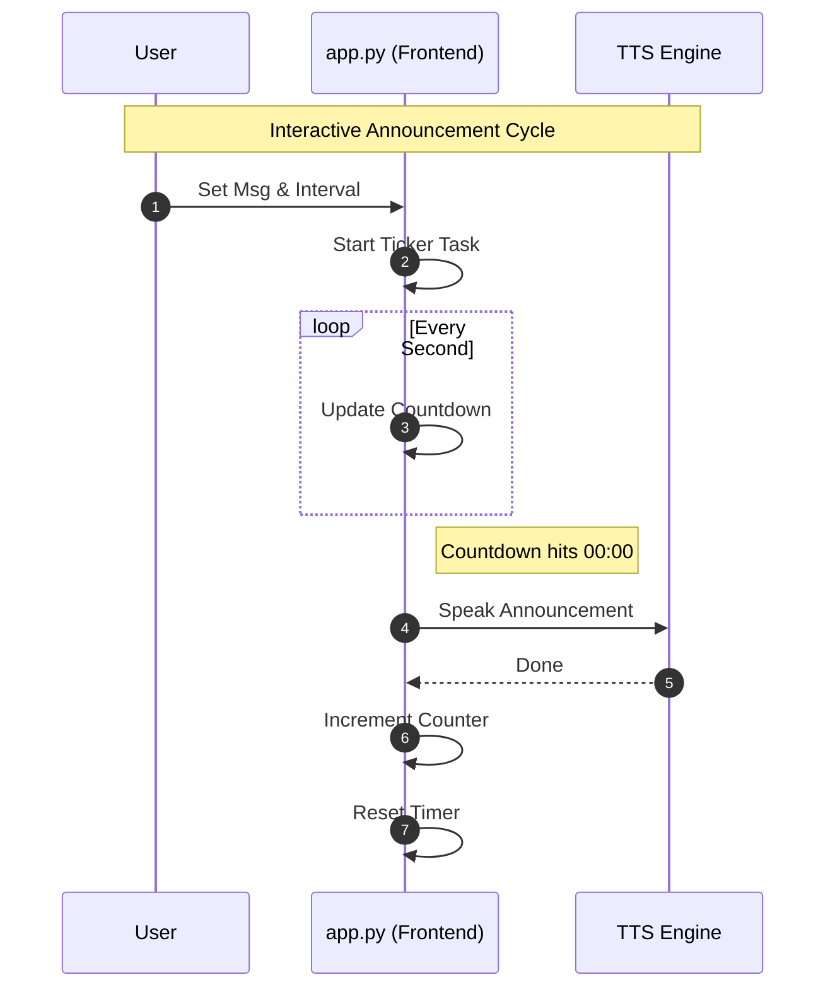

# 📷 Camera Automation Hub

A Python-powered computer-vision toolkit that watches your webcam, detects faces, and automatically adjusts screen brightness — plus a built-in **Exam Announcer** that repeats voice announcements at a configurable interval. Everything runs through a FastAPI backend and a sleek Solara browser UI.

---

## 📊 System Architecture



---

## ✨ Features

### 🎥 Camera Controller
- **Real-time face detection** using dual OpenCV Haar Cascade classifiers (frontal + alt2) with multi-frame voting for accuracy
- **Automatic brightness control** — screen goes to 100 % when a face is detected, 0 % when nobody is present
- **Live dashboard** — one-click start/stop monitoring with a status badge, brightness progress bar, and stat cards
- **Background polling** every 3 seconds while monitoring is active

### 📢 Exam Announcer
- **Text-to-speech** announcements via `pyttsx3`
- **Repeating timer** — set an interval (in minutes) and the announcement plays automatically on loop until cancelled
- **Live countdown** displayed in the browser between announcements
- **Repeat counter** — tracks how many times the announcement has been played
- **Announcement history** — timestamped log of every announcement made during the session
- **Mesmerizing UI** 🌟 — features a sleek "Cosmic Gradient" animated heading, interactive neon glassmorphism inputs, and a glowing fiery pulse indicator when speaking.
- Perfect for **exam practicals** — call groups of students at regular intervals hands-free

---

## 🌊 Flow for Features



---

## 🧠 Flow for Tech



---

## 🗂️ Project Structure

```
Camera_model/
├── logic.py            # Core: webcam capture, face detection, brightness control
├── custom_api.py       # FastAPI backend (/check-faces endpoint)
├── app.py              # Solara browser frontend (Camera Controller + Exam Announcer)
├── debug_camera.py     # Diagnostic tool — tests camera indexes & saves debug frames
├── test_logic.py       # Quick smoke test for logic.py
├── requirement.txt     # Python dependencies
└── README.md
```

---

## 🔄 Logic Flow

### 📷 Camera Automation Loop


### 📢 Exam Announcer Flow


---

## ⚙️ Installation

### 1. Clone the repository

```bash
git clone https://github.com/keshavmishra27/Camera_model.git
cd Camera_model
```

### 2. Create a virtual environment

```bash
python -m venv venv

# Windows
venv\Scripts\activate

# Linux / Mac
source venv/bin/activate
```

### 3. Install dependencies

```bash
pip install -r requirement.txt
```

---

## 🚀 Running the App

You need **two terminals** running at the same time.

### Terminal 1 — Start the backend

```bash
uvicorn custom_api:app --reload
```

Backend runs at: `http://127.0.0.1:8000`

### Terminal 2 — Start the frontend

```bash
solara run app.py
```

Frontend runs at: `http://localhost:8765`

Open that URL in your browser to use the hub.

---

## 🖥️ Using the Dashboard

### Camera Controller tab

1. Click **Start Monitoring** — the app checks your webcam every 3 seconds
2. Screen brightness adjusts automatically based on face detection
3. Uncheck the monitoring checkbox to stop

### Exam Announcer tab

1. Type or edit the **announcement message**
2. Set the **repeat interval** in minutes (e.g. `15` = every 15 minutes)
3. Click **🔊 Start Repeating Announcement**
4. A live countdown appears; when it reaches 00:00, the message is spoken aloud
5. The cycle repeats automatically — a counter shows how many times it has played
6. Click **✖ Cancel** at any time to stop

---

## 🔌 API Endpoints

### `GET /`

Health check.

```json
{ "message": "Face Brightness Controller Running" }
```

### `GET /check-faces`

Captures a webcam frame, runs face detection, sets brightness, and returns the result.

```json
{
  "faces_detected": 1,
  "brightness_set": 100
}
```

---

## 📄 File Details

### `logic.py`
- Opens the webcam, warms up the sensor (skips 20 frames), then takes 3 sample frames
- Converts each to grayscale with histogram equalisation
- Runs **two** Haar Cascade classifiers and takes the max face count (voting)
- Sets screen brightness via `screen_brightness_control`

### `custom_api.py`
- Minimal FastAPI app with two endpoints (`/` and `/check-faces`)
- Calls `process_frame()` from `logic.py` and returns JSON

### `app.py`
- Solara frontend with a **tab-based layout**: Camera Controller and Exam Announcer
- Reactive state management for face count, brightness, status, and announcements
- Background threads for both webcam polling and announcement scheduling
- Components: status badge, brightness bar, stat cards, countdown timer, history log

### `debug_camera.py`
- Standalone diagnostic script — run `python debug_camera.py`
- Tests camera indexes 0–2, saves raw + face-annotated frames as JPEG
- Useful for troubleshooting camera access or detection issues

---

## 🛠️ Tech Stack

| Layer     | Technology                       |
| --------- | -------------------------------- |
| Vision    | OpenCV (Haar Cascade)            |
| Brightness| screen-brightness-control        |
| TTS       | pyttsx3                          |
| Backend   | FastAPI + Uvicorn                |
| Frontend  | Solara                           |
| Language  | Python 3.10+                     |

---
